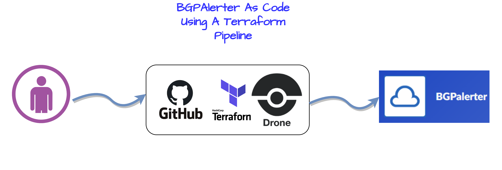
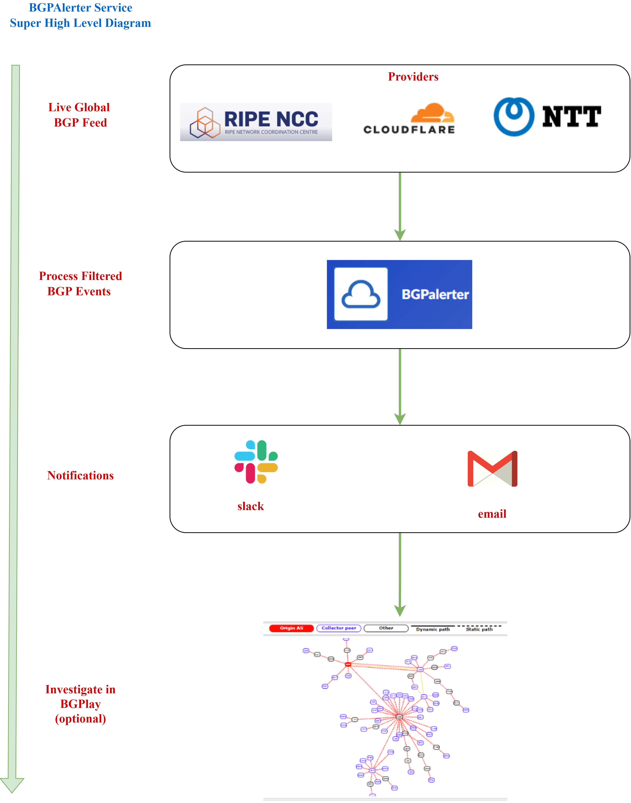
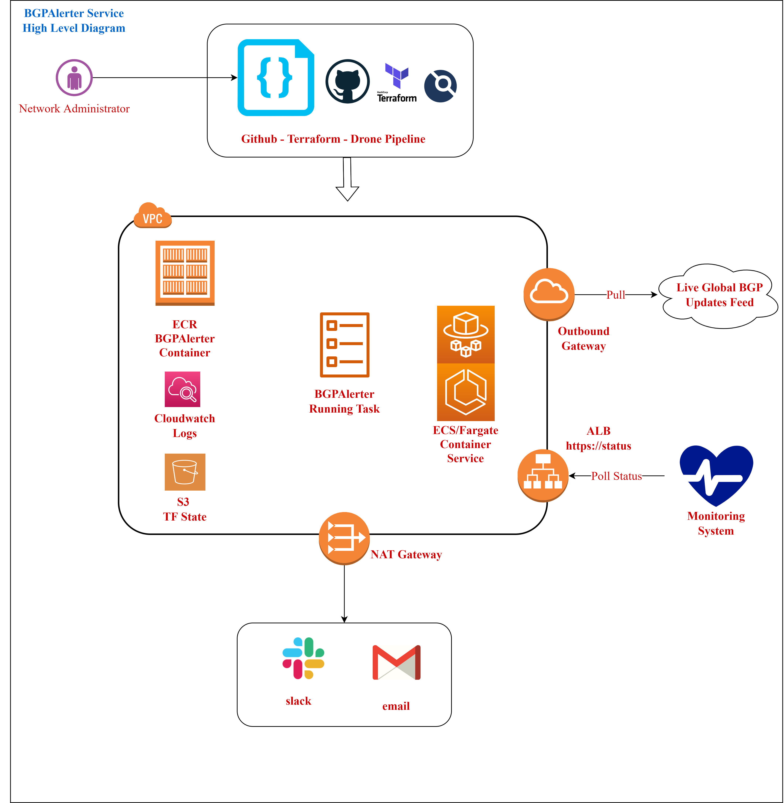
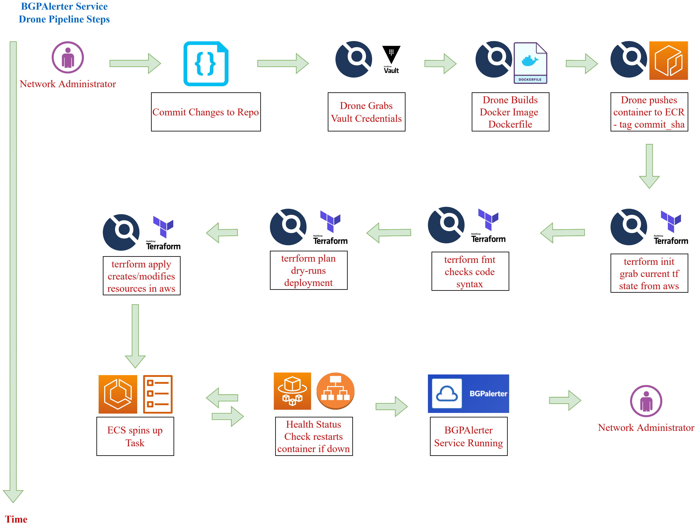

# bgpalerter as code
**[BGPAlerter](https://github.com/nttgin/BGPalerter)** is a well-engineered and useful tool built by [Massimo Candela](https://github.com/massimocandela) which allows you to monitor,
in real-time, important BGP updates to your desired list of Prefixes and ASNs on the public internet. 

## Overview

* This repo serves as a guide on how to deploy BGPAlerter as a service in an Amazon ECS Fargate container using a Github, Terraform, Drone Pipeline
* This repo is not meant to be "plug-and-play" ready, there are some parts of the infrastructure omitted (such as the VPC, Route53, IAM etc). 
* The key learning takeaways of this repo is how to format the drone pipeline, docker file, ecr.tf and ecs.tf files
* Credit goes to the devops folks at my org from whom I borrowed much of the terraform code and made my own tweaks as needed.
* This repository is referenced in my blogpost https://kaonbytes.com/p/bgpalerter-as-code/

## Flow Diagrams

### Super High Level Diagram

### High Level Diagram

### Drone Pipeline Steps

